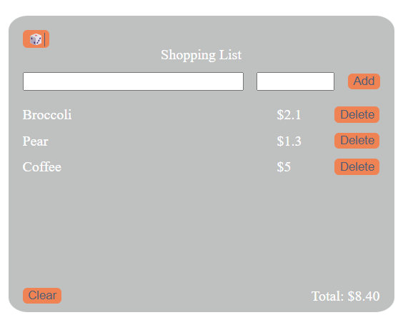

# 🛒 Shopping List App

### README Disclaimer
*README.md is partially generated and formatted using AI*

---
## Description

A simple interactive shopping list built with **HTML, CSS, and JavaScript**.  
The app allows you to **add items manually, generate random products, delete them, and calculate the total cost**.  
It also includes **basic input validation, error messages, and fun UI interactions**.

---
## 🚀 Features

- ➕ Add new items with **name** and **price**
- 🎲 Add **random product** from a pre-defined list of 50+ grocery items
- ❌ Delete items individually
- 🧹 Clear entire cart with **confirmation dialog**
- 💲 Automatic **total price calculation**
- ⚠️ **Validation**:
  - Name must be at least 2 characters
  - Price cannot be empty or negative
- 🎨 UI/UX Enhancements:
  - Error messages disappear after 1 second
  - Hover effect on the **Clear** button
  - Dynamic placeholder hints when focusing on inputs

---

## 🖼️ Demo Preview



---

## 🛠️ Tech Stack

- **HTML5** – Structure
- **CSS3** – Styling
- **Vanilla JavaScript (ES6+)** – Logic & Interactivity
- **DOM & BOM APIs** – Event handling, validation, alerts, confirms

---

## 📂 Project Structure
```bash
📦 shopping-list
┣ 📜 index.html # App layout
┣ 📜 style.css # Styles
┣ 📜 script.js # Main logic
┗ 📜 README.md # Project docs
```
---

## ⚡ Usage

1. Clone the repo:
   ```bash
   git clone https://github.com/your-username/shopping-list.git
2. Open index.html in your browser.

3. Start adding products! 🎉

---

## 🎲 Cool Feature
### Example Random Products
Some of the items in the pre-built random list:

```bash
🍎 Apple – $ 1.20
🥦 Broccoli – $ 2.10
🥩 Beef Steak – $ 9.90
🐟 Salmon – $ 12.00
☕ Coffee – $ 5.00
🍫 Chocolate – $ 2.50
(And 45+ more items!)
```
---
## 🧑‍💻 Author
Made with ❤️ by [Dmitrii Izrailit aka Lukatami]